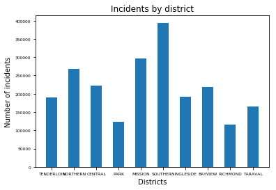

# Cassandra

##  Cassandra driver for Python


```python
from cassandra.cluster import Cluster
import matplotlib.pyplot as plt
```

## Connect Database


```python
cluster = Cluster(['127.0.0.1'])
session = cluster.connect()
session.set_keyspace('incidencias')
```

## Functions


```python
#listar todas las categorias
def get_categories():
	rows_categories = session.execute('SELECT category FROM categorias')
	categories = []
	for category in rows_categories:
   		categories.append(category.category)
	return categories


#listar todos los distritos
def get_districts():
	rows_districts = session.execute('SELECT pddistrict FROM distritos')
	districts = []
	for district in rows_districts:
   		districts.append(district.pddistrict)
	return districts


#cantidad distritos
def get_num_districts():
	num_districts = session.execute('SELECT count(*) FROM distritos')
	return num_districts[0].count


#Listar incidencias según el distrito'
def get_incidents_by_district(district):
	rows_incidents = session.execute('SELECT * FROM incidencias.incidenciasbyzona WHERE pddistrict=%s',[district])
	return rows_incidents


#Número incidencias según el distrito'
def get_num_incidents_by_district(district):
	num_incidents = session.execute('SELECT COUNT(*) FROM incidencias.incidenciasbyzona WHERE pddistrict=%s',[district])
	return num_incidents[0].count


#Listar incidencias según el distrito y la categoria
def get_incidents_by_category_district(category,district):
	rows_incidents = session.execute('SELECT * FROM incidencias.incidenciasbycategoriazona WHERE Category=%s AND pddistrict=%s',[category,district])
	return rows_incidents


#Número de incidencias según el distrito y la categoria
def get_num_incidents_by_category_district(category,district):
	num_incidents = session.execute('SELECT COUNT(*) FROM incidencias.incidenciasbycategoriazona WHERE Category=%s AND pddistrict=%s',["SUICIDE","BAYVIEW"])
	return num_incidents[0].count


#Listar incidencias según el distrito, la categoria, fecha inicio y fin
def get_incidents_by_category_district_betweendate(category,district,date_start,date_end):
	rows_incidents = session.execute('SELECT * FROM incidencias.incidenciasbycategoriazonafecha WHERE Category=%s AND pddistrict=%s AND date >= %s AND date <= %s',["SUICIDE","BAYVIEW","2017-06-01","2018-08-01"])
	return rows_incidents


#Número de incidencias según el distrito, la categoria, fecha inicio y fin
def get_num_incidents_by_category_district_betweendate(category,district,date_start,date_end):
	num_incidents = session.execute('SELECT COUNT(*) FROM incidencias.incidenciasbycategoriazonafecha WHERE Category=%s AND pddistrict=%s AND date >= %s AND date <= %s',["SUICIDE","BAYVIEW","2017-06-01","2018-08-01"])
	return num_incidents[0].count

```

## Testing functions


```python
print("Number of districts: ", get_num_districts())
print("Number of incidents in NORTHERN: ", get_num_incidents_by_district('NORTHERN')) 
print("Number of cases of SUICIDE in BAYVIEW between 2017-06-01 and 2018-08-01: ", get_num_incidents_by_category_district_betweendate('SUICIDE','BAYVIEW','2017-06-01','2018-08-01'))
```

    Number of districts:  10
    Number of incidents in NORTHERN:  269027
    Number of cases of SUICIDE in BAYVIEW between 2017-06-01 and 2018-08-01:  2
    

## Plot


```python
#Plot
districts = get_districts()
list_inc = []
for dis in districts: # RETRIVE THE COUNT OF INCIDENTS FOR EACH DISTRICT
    list_inc.append(get_num_incidents_by_district(dis))

fig = plt.figure()
plot = fig.add_subplot(111)

xx = range(1, len(list_inc)+1)

# BAR CHART
plot.bar(xx, list_inc, width=0.5)
plot.set_xticks(xx)
plot.set_xticklabels(districts)
plot.set_title('Incidents by district')
plot.set_xlabel('Districts')
plot.set_ylabel('Number of incidents')
plot.tick_params(axis='both', which='major', labelsize=6)

plt.show() # SHOW THE BAR CHART
fig.savefig('incidents_by_district.png') # SAVE THE CHART
```




